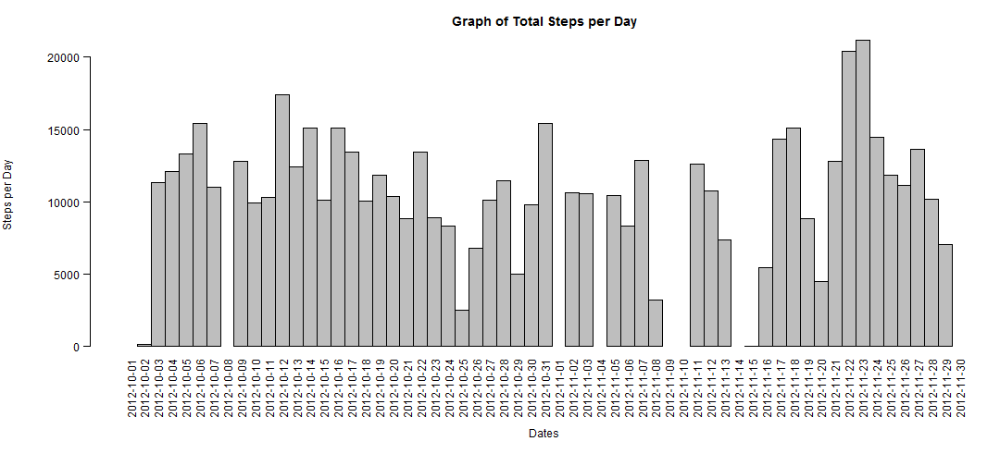
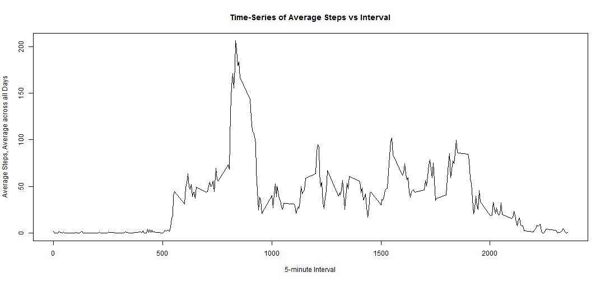
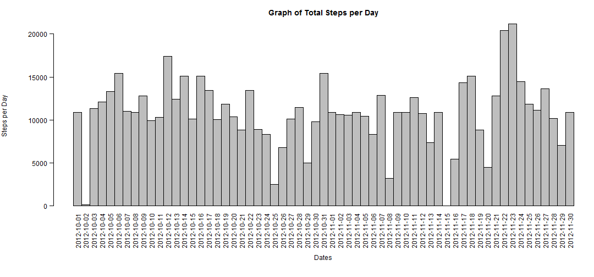
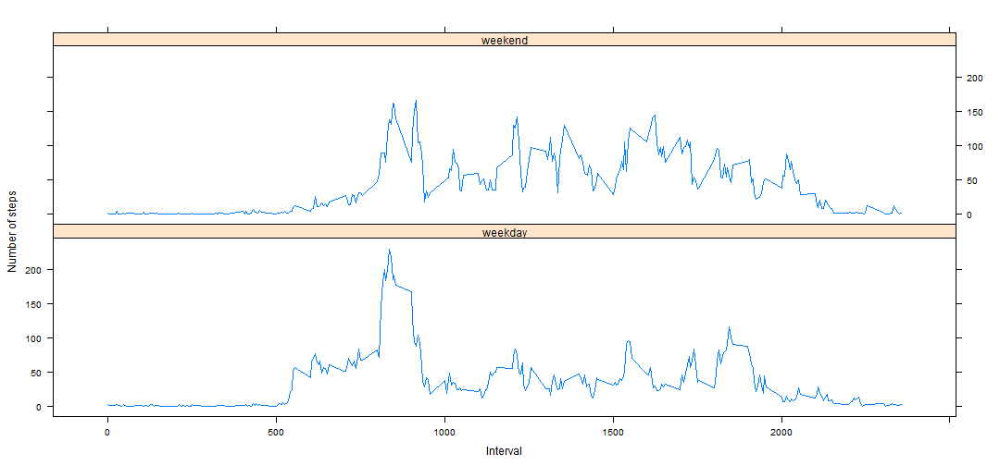

# Reproducible Research: Peer Assessment - 1


## Reading Data from csv file


```r
rawdata <- read.csv("activity.csv")
```

First 5 lines of raw data

```
##    steps       date interval
## 1     NA 2012-10-01        0
## 2     NA 2012-10-01        5
## 3     NA 2012-10-01       10
## 4     NA 2012-10-01       15
## 5     NA 2012-10-01       20
## 6     NA 2012-10-01       25
## 7     NA 2012-10-01       30
## 8     NA 2012-10-01       35
## 9     NA 2012-10-01       40
## 10    NA 2012-10-01       45
```

### What is mean total number of steps taken per day?
 
1. A dataset containing the total number of steps taken each day is created.

  
  ```r
  totaldailyStep <- aggregate(rawdata$steps, list(rawdata$date), sum)
  ```
   A portion of the new dataset is as follows:
  
  ```
  ##          Date Steps
  ## 1  2012-10-01    NA
  ## 2  2012-10-02   126
  ## 3  2012-10-03 11352
  ## 4  2012-10-04 12116
  ## 5  2012-10-05 13294
  ## 6  2012-10-06 15420
  ## 7  2012-10-07 11015
  ## 8  2012-10-08    NA
  ## 9  2012-10-09 12811
  ## 10 2012-10-10  9900
  ```

2. A histogram of the above data is created as a form of visual representation.

  
  ```r
  with(totaldailyStep, {
      par(oma=c(2,0,0,0), mar=c(6.75,6.75,3,0), mgp=c(5.75,0.75,0), las=2)
      barplot(
        height=Steps,
        main="Graph of Total Steps per Day",
        xlab="Dates",
        ylab="Steps per Day",
        names.arg=Date,
        space=c(0)
      )
  })
  ```
  
   

3. Calculate the mean and median values (ignoring NA values) using the above dataset.

  1. Mean
      
      ```r
      dailyStepmean <- mean(totaldailyStep$Steps, na.rm=TRUE)
      ```
      
      ```
      ## [1] 10766.19
      ```
  2. Median
      
      ```r
      dailyStepmedian <- median(totaldailyStep$Steps, na.rm=TRUE)
      ```
      
      ```
      ## [1] 10765
      ```

## What is the average daily activity pattern?

1. Generate the mean (average) number of steps taken (ignoring NA values) for each 5-minute interval, itself averaged across all days.
  
  
  ```r
  intervalSteps <- aggregate(
      data=rawdata,
      steps~interval,
      FUN=mean,
      na.action=na.omit
  )
  colnames(intervalSteps) <- c("Interval", "AvgStepsAvgAcrossDay")
  ```
   A portion of the new dataset is as follows:
  
  ```
  ##    Interval AvgStepsAvgAcrossDay
  ## 1         0            1.7169811
  ## 2         5            0.3396226
  ## 3        10            0.1320755
  ## 4        15            0.1509434
  ## 5        20            0.0754717
  ## 6        25            2.0943396
  ## 7        30            0.5283019
  ## 8        35            0.8679245
  ## 9        40            0.0000000
  ## 10       45            1.4716981
  ```
  
2. A Time-Series plot is created from the above dataset

  
  ```r
  with(intervalSteps, {
      plot(
        x=Interval,
        y=AvgStepsAvgAcrossDay,
        type="l",
        main="Time-Series of Average Steps vs Interval",
        xlab="5-minute Interval",
        ylab="Average Steps, Average across all Days"
        
      )
  })
  ```
  
   
  
3. Finding the 5-minute interval with the maximum number of steps

  
  ```r
  intervalMax <- intervalSteps[intervalSteps$AvgStepsAvgAcrossDay==max(intervalSteps$AvgStepsAvgAcrossDay),]
  ```
  
  ```
  ##     Interval AvgStepsAvgAcrossDay
  ## 104      835             206.1698
  ```
  Therefore, the interval between **835** and  **840** minutes has the maximum number of steps.

## Imputing missing values

1. Total number of rows with NA values in original data.

  
  ```r
  countNA <- nrow(subset(rawdata, is.na(rawdata$steps)))
  ```
  
  ```
  ## [1] 2304
  ```

2. The average 5-minute interval values from the prevous section is used to replace the NA values of the original data and a new dataset will be generated from the latter.

 Decimal values will be rounded up to a whole number.
 
  
  ```r
  stepValues <- data.frame(rawdata$steps)
  stepValues[is.na(stepValues),] <- ceiling(tapply(X=rawdata$steps,INDEX=rawdata$interval,FUN=mean,na.rm=TRUE))
  newData <- cbind(stepValues, rawdata[,2:3])
  colnames(newData) <- c("Steps", "Date", "Interval")
  ```
  
  A portion of the new dataset is as follows:
  
  ```
  ##    Steps       Date Interval
  ## 1      2 2012-10-01        0
  ## 2      1 2012-10-01        5
  ## 3      1 2012-10-01       10
  ## 4      1 2012-10-01       15
  ## 5      1 2012-10-01       20
  ## 6      3 2012-10-01       25
  ## 7      1 2012-10-01       30
  ## 8      1 2012-10-01       35
  ## 9      0 2012-10-01       40
  ## 10     2 2012-10-01       45
  ```

3. The total number of steps taken each day is generated using this new dataset.

  
  ```r
  totalnewDailyStep <- aggregate(newData$Steps, list(newData$Date), sum)
  ```
   A portion of the new dataset is as follows:
  
  ```
  ##          Date Steps
  ## 1  2012-10-01 10909
  ## 2  2012-10-02   126
  ## 3  2012-10-03 11352
  ## 4  2012-10-04 12116
  ## 5  2012-10-05 13294
  ## 6  2012-10-06 15420
  ## 7  2012-10-07 11015
  ## 8  2012-10-08 10909
  ## 9  2012-10-09 12811
  ## 10 2012-10-10  9900
  ```

4. A histogram of the above data is created as a form of visual representation.

  
  ```r
  with(totalnewDailyStep, {
      par(oma=c(2,0,0,0), mar=c(6.75,6.75,3,0), mgp=c(5.75,0.75,0), las=2)
      barplot(
        height=Steps,
        main="Graph of Total Steps per Day",
        xlab="Dates",
        ylab="Steps per Day",
        names.arg=Date,
        space=c(0)
      )
  })
  ```
  
   

5. Calculate the mean and median values of this new dataset (NA values replaced with mean).

  1. Mean
      
      ```r
      newDailyStepmean <- mean(totalnewDailyStep$Steps)
      ```
      
      ```
      ## [1] 10784.92
      ```
  2. Median
      
      ```r
      newDailyStepmedian <- median(totalnewDailyStep$Steps)
      ```
      
      ```
      ## [1] 10909
      ```
      
6. It seems that adding the missing values to the original data has caused both the mean and median values to increase.

  1. Mean:
  
      10766 to 10784
  2. Median:
  
      10765 to 10909


## Are there differences in activity patterns between weekdays and weekends?
1.  A new column indicating whether the date is a weekday or a weekend is added to the new dataset created in the previous section.

  
  ```r
  dateDayType <- data.frame(sapply(X=newData$Date, FUN=function(day) {
    if (weekdays(as.Date(day)) %in% c("Monday", "Tuesday", "Wednesday", "Thursday", "Friday")) {
      day <- "weekday"
    }
    else {
      day <- "weekend"
    } 
  }))
  
  newDataWithDayType <- cbind(newData, dateDayType)
  
  colnames(newDataWithDayType) <- c("Steps", "Date", "Interval", "DayType")
  ```
  
   A portion of this dataset is as follows:
  
  ```
  ##    Steps       Date Interval DayType
  ## 1      2 2012-10-01        0 weekday
  ## 2      1 2012-10-01        5 weekday
  ## 3      1 2012-10-01       10 weekday
  ## 4      1 2012-10-01       15 weekday
  ## 5      1 2012-10-01       20 weekday
  ## 6      3 2012-10-01       25 weekday
  ## 7      1 2012-10-01       30 weekday
  ## 8      1 2012-10-01       35 weekday
  ## 9      0 2012-10-01       40 weekday
  ## 10     2 2012-10-01       45 weekday
  ```
2. The data is then separated into weekday or weekend and the mean (average) number of steps taken for each 5-minute interval, itself averaged across all weekday days or weekend days is calculated.

  
  ```r
  dayTypeIntervalSteps <- aggregate(
      data=newDataWithDayType,
      Steps ~ DayType + Interval,
      FUN=mean
  )
  ```
   A portion of the dataset is as follows:
  
  ```
  ##    DayType Interval     Steps
  ## 1  weekday        0 2.2888889
  ## 2  weekend        0 0.2500000
  ## 3  weekday        5 0.5333333
  ## 4  weekend        5 0.1250000
  ## 5  weekday       10 0.2888889
  ## 6  weekend       10 0.1250000
  ## 7  weekday       15 0.3111111
  ## 8  weekend       15 0.1250000
  ## 9  weekday       20 0.2222222
  ## 10 weekend       20 0.1250000
  ```

3. Finally, a panel plot of both weekend and weekday graphs is generated.

  
  ```r
  library("lattice")
  
  xyplot(
      type="l",
      data=dayTypeIntervalSteps,
      Steps ~ Interval | DayType,
      xlab="Interval",
      ylab="Number of steps",
      layout=c(1,2)
  )
  ```
  
   
